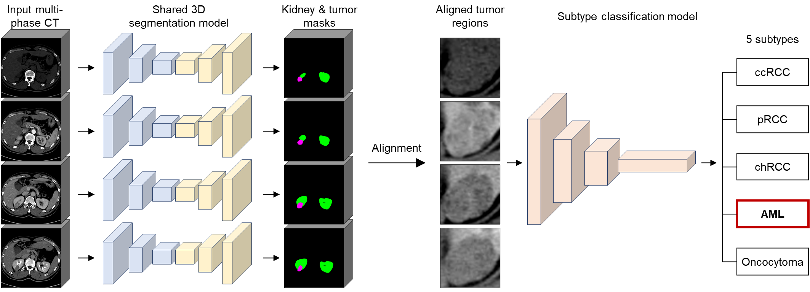
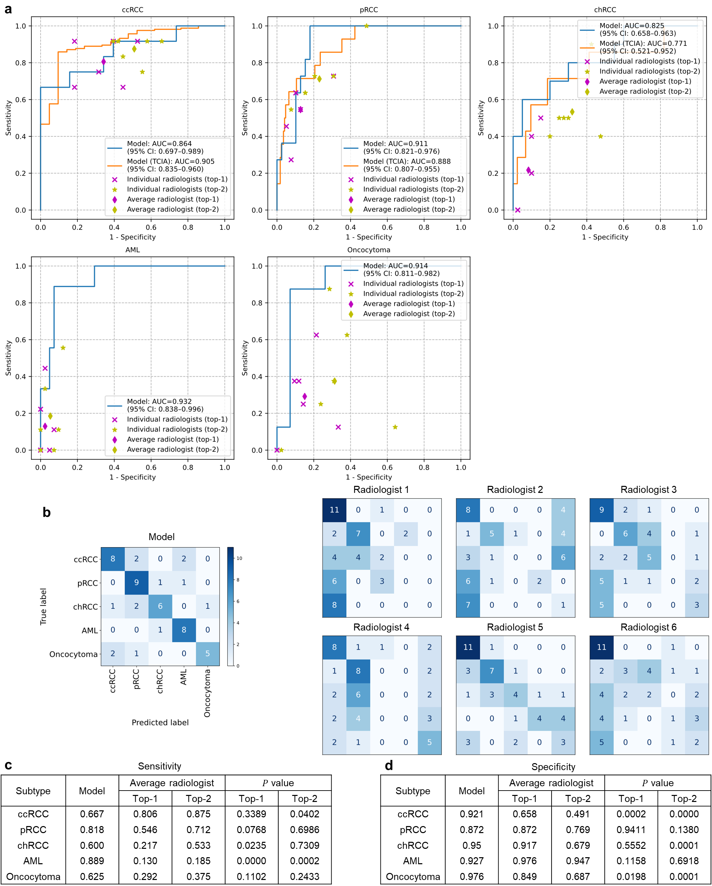

# Deep Learning for End-to-End Kidney Cancer Diagnosis on Multi-Phase Abdominal Computed Tomography
## Framework


## Results (AI vs Radiologists)


## Requirements
* Python 3.6
* Pytorch 1.2
* Ubuntu 16.04
* TITAN Xp

## Installation
```
git clone https://github.com/khuhm/deep-kidney-cancer.git
cd deep-kidney-cancer/
```

## Training
```
python train.py
```

## Evaluation
```
python eval.py
```

## Citation
>Uhm, KH., Jung, SW., Choi, M.H. et al. Deep learning for end-to-end kidney cancer diagnosis on multi-phase abdominal computed tomography. *npj Precis. Onc*. **5,** 54 (2021). https://doi.org/10.1038/s41698-021-00195-y


